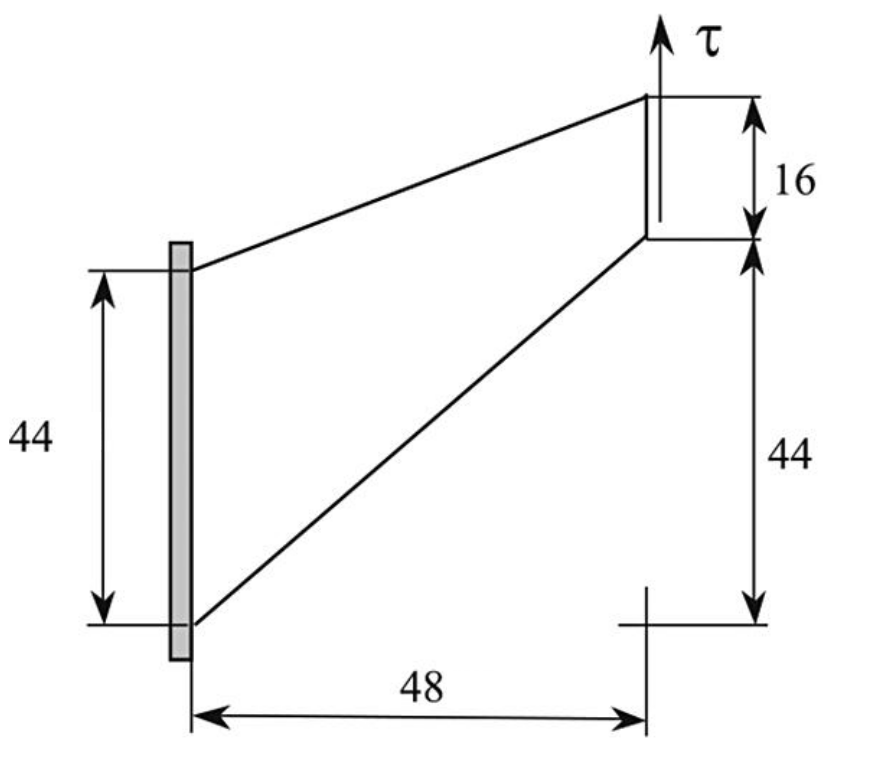
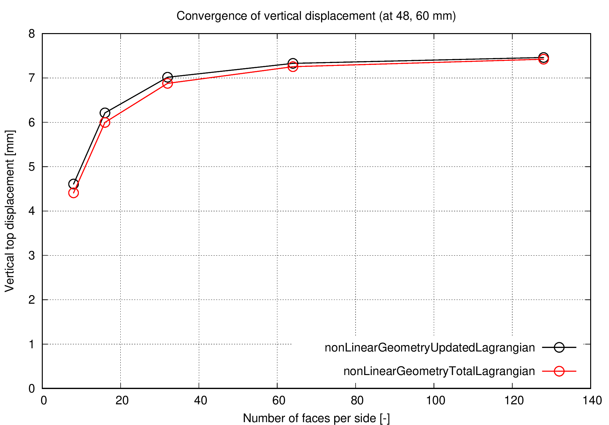
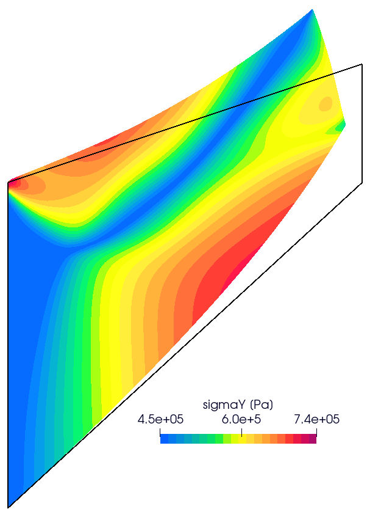

# `Cook's membrane`

---

Author: Ivan Batistić, 07/2023

---

## Case overview

Cook's membrane is a well-known bending-dominated benchmark case used both in linear and non-linear analysis. The tapered panel (trapezoid) is fixed on one side and subjected to uniform shear traction on the opposite side. The prescribed shear traction is $\tau = 312500$ Pa. The vertices of the trapezoid (in mm) are (0, 0), (48, 44), (48, 60),  and (0, 44). Membrane geometry is shown in the figure below. Gravitation effects are neglected, there are no body forces and the problem is solved as 2D using plane strain assumption. The problem is solved as static, using 30 equally-sized loading increments. 

The material is considered elasto-plastic, with the following property values: Young's modulus $E = 206.9$ MPa, Poisson's ratio $\nu=0.29$, initial yield stress $\sigma_Y = 0.45$ MPa and the hardening parameters $\sigma_{\infty} = 0.715$ MPa, $\delta = 16.93$, $H = 0.12924$ MPa. The strain hardening function is the one presented in [1]:
$$
\sigma_y = \sigma_Y + (\sigma_{\infty} - \sigma_Y)(1-\text{exp}(-\delta\varepsilon_p)) + H\varepsilon_p.
$$


<div style="text-align: center;">
  
    <figcaption>
     <strong>Figure 1: Problem geometry</strong>
    </figcaption>
</div>
The script is adjusted to perform simulation on 5 uniformly refined grids.
The coarsest grid consists of 64 CVs and the finest of 4096 CVs.

```warning
The case is set using foam-extend 4.1. 
Other versions of the OpenFOAM may require some small tweaks.
```

---

## Benchmark purpose

* To test solver under elasto-plastic, finite strain material regime
* The problem is complicated as both shear and bending are present in combination with a skew numerical mesh.

---

## Expected results

* Around the top-left corner, the elastic body is squeezed the most
* The body is stretched the most near the bottom side
* There is no known analytical solution for this problem.

Figure 2 shows the convergence of the vertical displacement in `solids4Foam` in the case of updated Lagrangian and total Lagrangian formulation. In both formulations, vertical displacement in the top right corner tends to a value of 7.4 mm, which is close to the values reported in [1,2,3].

<div style="text-align: center;">
  
    <figcaption>
     <strong>Figure 2: Convergence of the vertical displacement in the top right corner 	</strong>
    </figcaption>
</div>

<div style="text-align: center;">
  
    <figcaption>
        <strong>Figure 3: Contours of &#963<sub>y</sub> stress. Black line denotes initial undeformed configuration </strong>
    </figcaption>
</div>

---

### Literature 

[1] [Simo, J. C., and F. Armero, “Geometrically Nonlinear Enhanced Strain Mixed Methods and the Method of Incompatible Modes,” International Journal for Numerical Methods in Engineering, vol. 33, pp. 1413–1449, 1992.](https://onlinelibrary.wiley.com/doi/10.1002/nme.1620330705)

[2] [http://www.simplassoftware.com/benchmarks.html](http://www.simplassoftware.com/benchmarks.html)

[4] [J.M.A. César de Sá, P. Areias and R.M. Natal Jorge. “Quadrilateral elements for the solution of elasto-plastic finite strain problems“. *IJNME*, 51:883-917, 2001.](https://repositorio-aberto.up.pt/handle/10216/438)
