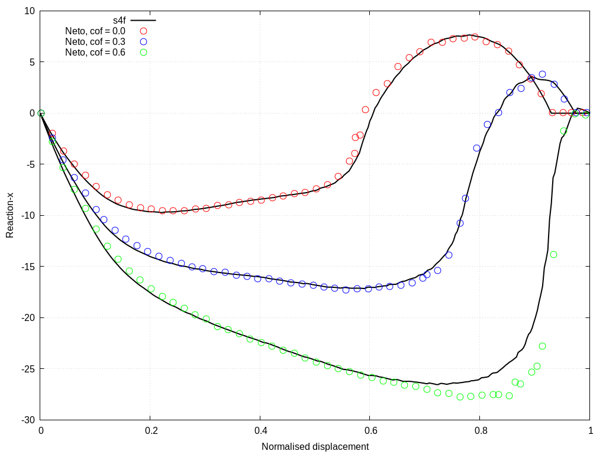

# Contact between curved beams: `curvedBeams`

---

Prepared by Ivan Batistić

---

## Case overview

This example considers large sliding between two curved beams (see figure below). The lower beam is fixed, whereas the upper beam has a prescribed horizontal displacement of $$u_x = 31.5$$ mm. Both beams are modelled as elastoplastic with isotropic hardening using the following material properties: Young’s modulus $$E = 689.56$$ MPa, Poisson’s ration $$\nu = 0.32$$, initial yield strength $$\sigma_Y = 31$$ MPa and linear hardening coefficient $$H^‘ = 261.2$$ MPa. The problem is solved using $$63$$ equal displacement increments, assuming the plane strain conditions. The frictionless and frictional responses can be considered. As regards the frictional response, two coefficients of friction are typically considered $$\mu = 0.3$$ and $$\mu = 0.6$$. The beams are  discretised using 50 CVs in the circumferential and 5 CVs in the radial direction. The problem is solved using the plane strain assumption and without body forces.

<div style="text-align: center;">
  
    <figcaption>
     <strong>Figure 1: Problem geometry (dimensions in mm) [1]</strong>
    </figcaption>
</div>

The script is adjusted to perform simulation for $$\mu=0$$, $$\mu=0.3$$ and $$\mu=0.6$$.

```warning
The case is set using foam-extend 4.1. 
Other versions of the OpenFOAM may require some small tweaks.
```

---

## Benchmark purpose

* To test solver when considering large sliding contact and elasto-plastic material regime.

---

## Expected results

* During the sliding, due to the larger diameter, the lower beam exhibits larger plastic deformation which is reduced by the larger values of the coefficient of friction.

Figures 2 and 3 compare the evolution of the horizontal and vertical total reaction force between `solids4foam` and results reported using finite element code  [[2]](https://www.sciencedirect.com/science/article/abs/pii/S0045782515003643). `solids4foam` results are obtained using updated Lagrangian formulation.

<div style="text-align: center;">
  
    <figcaption>
     <strong>Figure 2: Total reaction force in x-direction 	</strong>
    </figcaption>
</div>

<div style="text-align: center;">
  
    <figcaption>
        <strong>Figure 3: Total reaction force in y-direction </strong>
    </figcaption>
</div>

---

### References

[1] [I. Batistić, P. Cardiff, and Ž. Tuković, “A finite volume penalty based segment-to-segment method for frictional contact problems,” Applied Mathematical Modelling, vol. 101, pp. 673–693, 2022.](https://www.sciencedirect.com/science/article/abs/pii/S0307904X21004248)https://www.sciencedirect.com/science/article/abs/pii/S0045782515003643

[2] [D. Neto, M. Oliveira, L. Menezes, and J. Alves, “A contact smoothing method for arbitrary surface meshes using Nagata patches,” Computer Methods in Applied Mechanics and Engineering, vol. 299, pp. 283 – 315, 2016.](https://www.sciencedirect.com/science/article/abs/pii/S0045782515003643)

