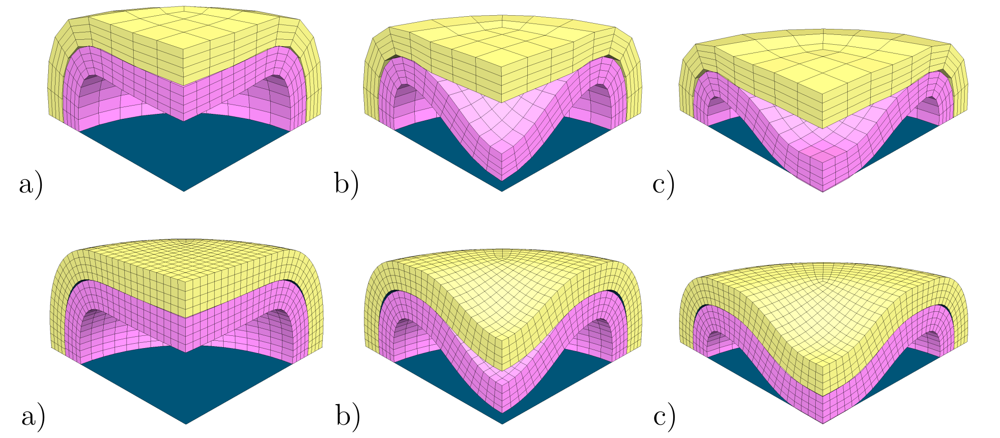
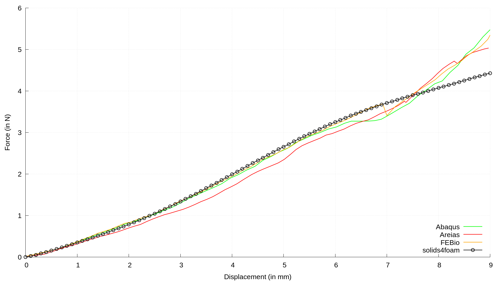
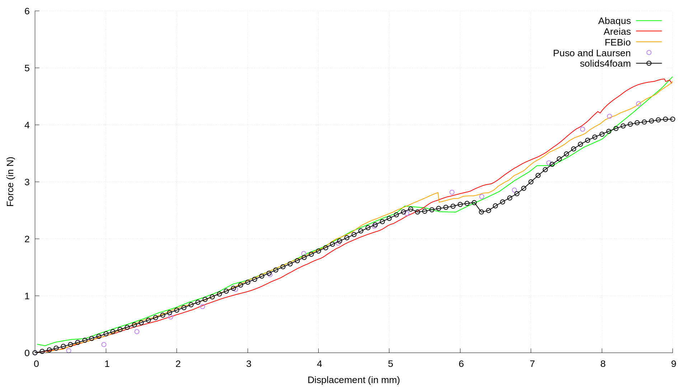

# Twisting Contact Between a Hemisphere and a Block: `twistingHemisphere`

---

Prepared by Ivan Batistić

---

## Case overview

Two thick-walled hollow concentric half-spheres are compressed between two rigid planes. Due to the geometric and the load symmetry, the computational model is modelled in quarter symmetry. The geometry of the computational model is shown in Fig. 1. The contact between the lower rigid plane and the inner sphere as well as contact between the upper rigid plane and the outer sphere is modelled as frictionless. For the contact between two spheres, two different coefficients of friction are considered ($$\mu = 0$$ and $$\mu = 0.5$$). The displacement of the upper rigid plane $$u_z = 10$$ mm is prescribed within $$100$$ equal displacement increments. The material property of both spheres is the same ($$E = 1$$ MPa and $$\nu = 0.3$$). The problem is solved by neglecting gravitational and inertial forces. 

<div style="text-align: center;">
  
    <figcaption>
     <strong>Figure 1: Problem geometry and computational mesh (inner sphere 2,420 CVs, outer sphere 1,620 CVs) [1]</strong> 
    </figcaption>
</div>


```warning
The case is set using foam-extend 4.1. 
Other versions of the OpenFOAM may require some small tweaks.
```

---

## Benchmark purpose

* To test solver when using hyperelastic mechanical law  (large deformations) with large sliding frictional contact.

---

## Expected results

* With coarser mesh, the outer sphere is less prone to buckling [1], see Figure 2. The same conclusion can be drawn by analysing results from the literature, as some authors reported the occurrence of buckling of the outer sphere and some did not.

<div style="text-align: center;">
  
    <figcaption>
     <strong>Figure 2: Deformed configurations of coarse and fine mesh for frictionless contact at: a) 5 mm, b) 6 mm, c) 7.5 mm [1]</strong> 
    </figcaption>
</div>


- Figure 3 and 4 shows the evolution of the compression force for the frictional and frictionless case, respectively. The compression force before buckling of the inner sphere matches well with the results from the literature. After the start of the inner sphere buckling, a difference exists in the evolution of the compression force and the structure shows less stiffness in `solids4foam`.

<div style="text-align: center;">
  
    <figcaption>
     <strong> <br> Figure 3: Evolution of the compression force for the frictional case (COF=0.5)</strong>
    </figcaption>
</div>

<div style="text-align: center;">
  
    <figcaption>
     <strong> <br> Figure 4: Evolution of the compression force for the frictionless case</strong>
    </figcaption>
</div>

The results from [2], [3] and [4] have been digitised using the [WebPlotDigitizer](https://apps.automeris.io/wpd/) software.


---

### References 

[1] [Ivan Batistić. Segment-to-Segment Algorithm for Finite Volume Mechanical Contact Simulations. University of Zagreb, PhD thesis, 2022.](https://www.sciencedirect.com/science/article/abs/pii/S0307904X21004248)

[2] [B. K. Zimmerman and G. A. Ateshian, “A surface-to-surface finite element algorithm for large deformation frictional contact in FEBio,” Journal of Biomechanical Engineering, vol. 140, no. 8, 2018.](https://www.ncbi.nlm.nih.gov/pmc/articles/PMC6056201/)

[3] [M. A. Puso and T. A. Laursen, “A mortar segment-to-segment contact method for large deformation solid mechanics,” Computer Methods in Applied Mechanics and Engineering, vol. 193, no. 6, pp. 601–629, 2004.](https://www.sciencedirect.com/science/article/abs/pii/S0045782503005802)

[4] [P. Areias, T. Rabczuk, F. J. Melo, and J. C. Sá, “Coulomb frictional contact by explicit projection in the cone for finite displacement quasi-static problems,” Computational Mechanics, vol. 55, no. 1, pp. 57–72, 2015.](https://link.springer.com/article/10.1007/s00466-014-1082-5)
