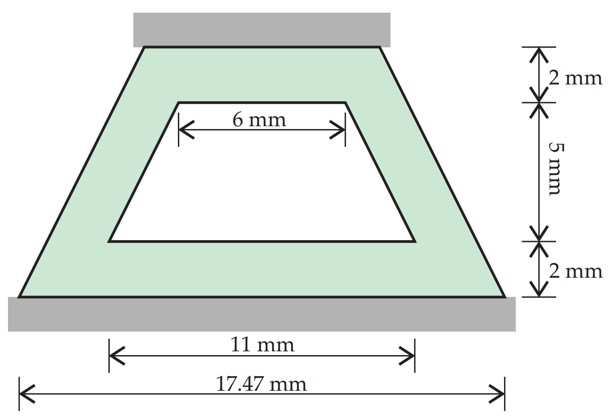
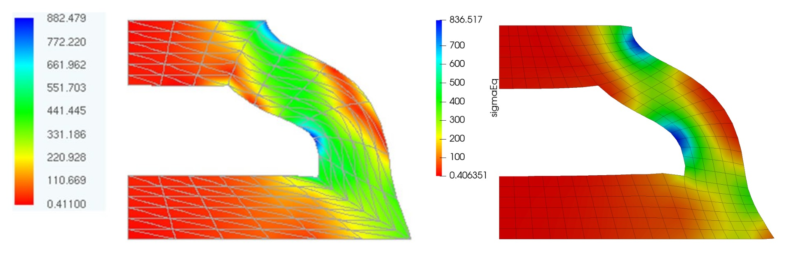

# Rubber Sealing

Prepared by Ivan Batistić and Philip Cardiff

## Overview

This benchmark case examines the compression of a rubber seal, as illustrated in Fig. 1. The material behaviour is modelled using a compressible hyperelastic Ogden model (third order). Material bulk modulus is $\kappa=1000$ N/mm$^2$  and the remaining material parameters are as follows:
$$
\mu_1 = 0.63 ~\text{N/mm}^2, \quad \mu_2 = 0.0012 ~\text{N/mm}^2, \quad \mu_3 = -0.01 ~\text{N/mm}^2, \qquad \alpha_1=1.3, \quad \alpha_2=5, \quad \alpha_3=-2
$$
The upper surface undergoes a prescribed displacement of $2.2$ mm, applied incrementally over $100$ equally spaced steps, while the bottom surface remains fixed. To exploit symmetry, only half of the seal is modelled.  The problem is solved as 2D assuming plane strain conditions. Given the complexity of the displacement and stress fields near the corners of the seal, numerical instabilities may occur during the simulation.

  
    <figcaption>
     <strong>Figure 1: Problem geometry [2]</strong>
    </figcaption>

### Expected Results

The deformed sealing, coloured with equivalent stress, is shown in Fig. 2. Side-by-side comparison is made with results from [2].

  
    <figcaption>
     <strong>Figure 2: Equivalent stress (in kPa) compared side-by side with results from [3]</strong>
    </figcaption>

### References 

[1] [Brink, U., & Stein, E., A posteriori error estimation in large-strain elasticity using equilibrated local Neumann problems. Computer Methods in Applied Mechanics and Engineering, 161(1-2),  (1998). 77–101.](https://www.sciencedirect.com/science/article/abs/pii/S0045782597003101)

[2] [Angoshtari, Arzhang, Mostafa Faghih Shojaei, and Arash Yavari. "Compatible-strain mixed finite element methods for 2D compressible nonlinear elasticity." *Computer Methods in Applied Mechanics and Engineering* 313 (2017): 596-631.](https://www.sciencedirect.com/science/article/abs/pii/S0045782516312798)

[3] [Pascon, João Paulo. "Large deformation analysis of plane-stress hyperelastic problems via triangular membrane finite elements." *International Journal of Advanced Structural Engineering* 11.3 (2019): 331-350.](https://link.springer.com/article/10.1007/s40091-019-00234-w)
