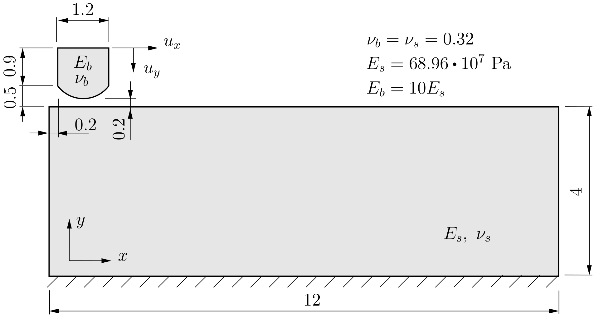
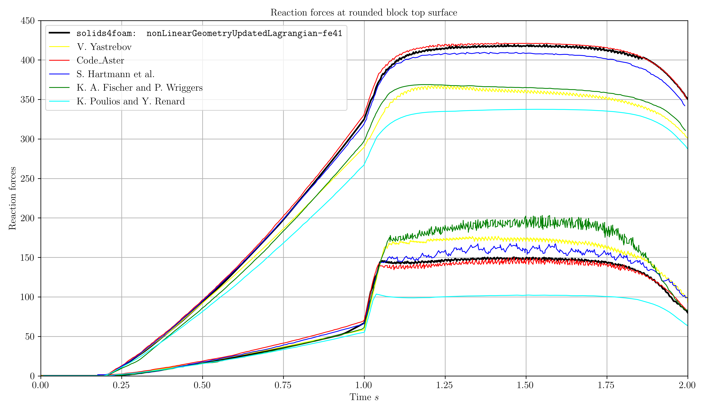

# Shallow Ironing: `shallowIroning`

---

Prepared by Ivan Batistić

---

## Case overview

A pressed elastic block with rounded contact surface slides over an elastic rectangular foundation. The foundation is fixed at the bottom and the block has a prescribed vertical and horizontal displacement. The problem geometry, material data and dimensions are shown in Fig. 1. A vertical displacement of the top surface of the block ($$u_y = 1$$ mm) is applied from $$0$$ to $$1$$ s and solved using $$100$$ equal displacement increments. A horizontal displacement ($$u_x = 10$$ mm) is subsequently added between $$1$$ and $$6$$ s and solved using $$500$$ equal displacement increments. The problem is solved under the plane strain assumption and without body forces and gravitational effects. At the contact interface, friction is considered, and the coefficient of friction is set to $$\mu = 0.3$$.

<div style="text-align: center;">
  
    <figcaption>
     <strong>Figure 1: Problem geometry (dimensions in mm) [1]</strong> 
    </figcaption>
</div>


```warning
The case is set using foam-extend 4.1. 
Other versions of the OpenFOAM may require some small tweaks.
```

---

## Benchmark purpose

* To test solver when using hyperelastic mechanical law with large deformations;
* To demonstrate solver performance when solving contact problems with material and geometrical nonlinearities (large deformations & large sliding).

---

## Expected results

* There is no unique agreement among results reported using the various finite element contact treatments [[2-8]](###references);

* The authors report the evolution of the horizontal and vertical components of the reaction force on the sliding block top surface;

* In addition to the reaction forces, another parameter to consider is the ratio between reaction forces. In literature, this ratio is referred to as the global coefficient of friction $$\mu_g$$. Table 1 summarises the values of the global coefficient of friction from the literature. 

  **Table 1: Comparison of global coefficients of friction $$\mu_g$$ (at $$t=1.5$$ s)**

  |                     |   [6]    |   [1]    |   [8]    |   [5]    |   [4]    |   [3]    |   [2]    |
  | :-----------------: | :------: | :------: | :------: | :------: | :------: | :------: | :------: |
  | $$(\mu_g)_{t=1.5}$$ | $$0.30$$ | $$0.32$$ | $$0.32$$ | $$0.34$$ | $$0.38$$ | $$0.47$$ | $$0.53$$ |

The evolution of the vertical and horizontal reaction forces is shown in Fig. 1. Compared to other results from the literature, `solids4foam` results obtained using `nonLinearGeometryUpdatedLagrangian-fe41` solver are closest to the results of `Code_Aster`. The resulting value of the global coefficient of friction is $$0.36$$. 

The reference plots have been digitised using the [WebPlotDigitizer](https://apps.automeris.io/wpd/) software.

<div style="text-align: center;">
  
    <figcaption>
     <strong> <br> Figure 2: Evolution of vertical and horizontal reaction force 	</strong>
    </figcaption>
</div>

---

### References 

[1] [I. Batistić, P. Cardiff and Ž. Tuković, “A finite volume penalty based segment-to-segment method for frictional contact problems,“ Applied Mathematical Modelling, Volume 101,2022.](https://www.sciencedirect.com/science/article/abs/pii/S0307904X21004248)

[2] [K. A. Fischer and P. Wriggers, “Mortar based frictional contact formulation for higher order interpolations using the moving friction cone,” Computer Methods in Applied Mechanics and Engineering, vol. 195, no. 37-40, pp. 5020–5036, 2006.](https://www.sciencedirect.com/science/article/abs/pii/S0045782505005359)

[3] [V. Yastrebov, Computational contact mechanics: geometry, detection and nu- merical techniques. PhD thesis, École Nationale Supérieure des Mines de Paris, 2011.](https://pastel.hal.science/pastel-00657305/file/yastrebov.pdf)

[4] [S. Hartmann, J. Oliver, R. Weyler, J. Cante, and J. Hernández, “A contact domain method for large deformation frictional contact problems. part 2: Numerical aspects,” Computer Methods in Applied Mechanics and Engineering, vol. 198, no. 33-36, pp. 2607–2631, 2009.](https://www.sciencedirect.com/science/article/abs/pii/S0045782509001297)

[5] [Code_Aster, “General public licensed structural mechanics finite element software, [v6.03.153] SSNP153 - deformable-deformable 2D rubbing contact in large deformations (shallow ironing).”, 2020.](https://www.code-aster.org/V2/doc/default/en/man_v/v6/v6.03.153.pdf)

[6] [K. Poulios and Y. Renard, “An unconstrained integral approximation of large sliding frictional contact between deformable solids,” Computers & Structures, vol. 153, pp. 75–90, 2015.](https://www.sciencedirect.com/science/article/pii/S0045794915000656)

[7] [Kopačka, J., Efficient and Robust Numerical Solution of Contact Problems by the Finite Element Method, PhD Thesis, Czech Technical University, Prague, 2018](https://www.researchgate.net/publication/325797406_Efficient_and_Robust_Numerical_Solution_of_Contact_Problems_by_the_Finite_Element_Method)

[8] [Houssein, H., ”Finite element modeling of mechanical contact problems for industrial applications”, PhD thesis, Sorbonne Université, Paris, 2022.](https://theses.hal.science/THESES-SU/tel-03699706v1)

[9] [https://www.youtube.com/watch?v=RL4X8c0A4ag](https://www.youtube.com/watch?v=RL4X8c0A4ag)
