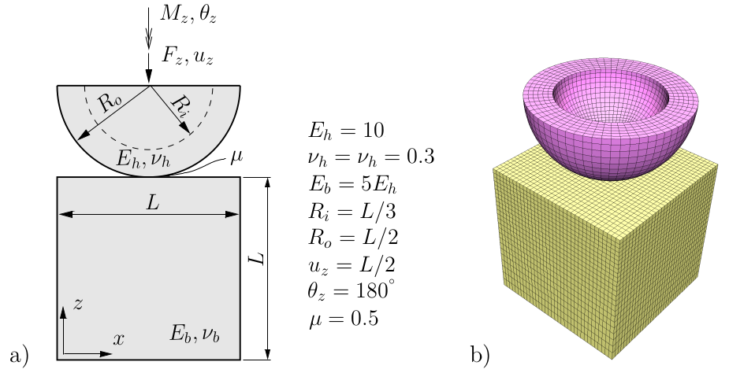
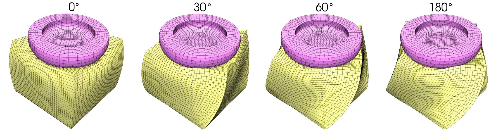
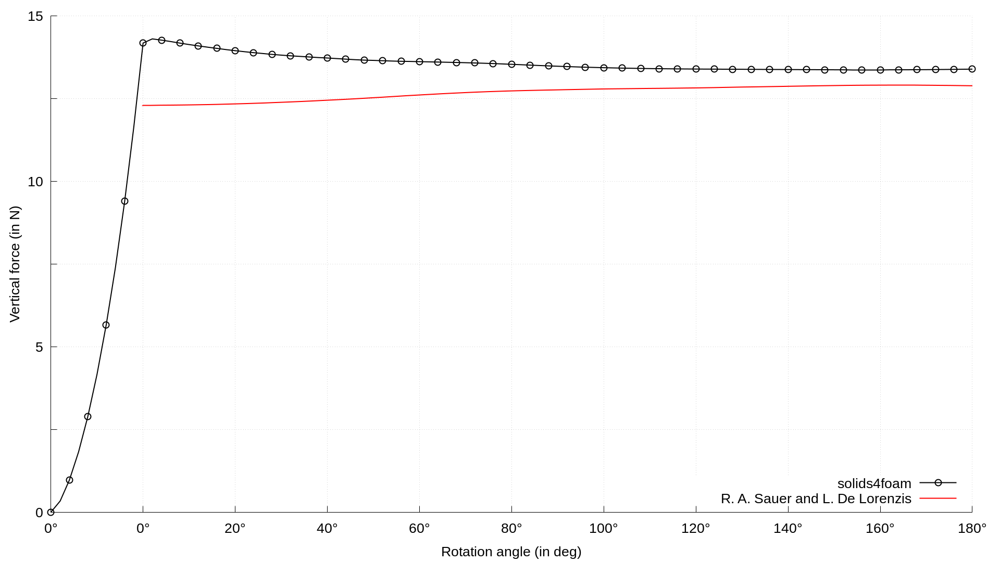

# Twisting Contact Between a Hemisphere and a Block: `twistingHemisphere`

---

Prepared by Ivan Batistić

---

## Case overview

A thick-walled hollow half-sphere is indented and twisted against a finite deformable block. The half-sphere downward motion is prescribed on its top surface, and it is equal by magnitude to sphere inner radius $$R_i$$ . After indentation, rigid rotation of the half-sphere top surface is subsequently added.  Friction is considered and a high value of the coefficient of friction $$\mu = 0.5$$ is prescribed. The problem geometry as well as material properties are shown in Fig. 1 a). Sphere indentation is prescribed within $$10$$ equal displacement increments, whereas sphere twisting is prescribed within $$90$$ equal rotation increments. The computational mesh at initial configuration is shown in Fig. 1 b). The problem is solved by neglecting gravitational and inertial forces. 
```note
In the original benchmark version, frictionless contact is prescribed during half-sphere indentation. This option is currently not available in solids4foam code; thus, friction is prescribed from the simulation beginning.
```

<div style="text-align: center;">
  
    <figcaption>
     <strong>Figure 1: a) problem geometry (L = 2) and material properties, b) computational mesh (block 27,744 CVs, half-sphere 7,680 CVs) [1]</strong> 
    </figcaption>
</div>

```warning
The case is set using foam-extend 4.1. 
Other versions of the OpenFOAM may require some small tweaks.
```

---

## Benchmark purpose

* To test solver when using hyperelastic mechanical law  (large deformations) with large sliding frictional contact.

---

## Expected results

* The high value of the coefficient of friction enables stick contact behaviour, which induces twisting of the block, as shown in Fig 2. During the twisting, the contact area is gradually transformed to the dominantly slip behaviour, which means that constant torque is transmitted to the block.  Consequently, the block exhibits constant deformation for larger half-sphere rotation angles.

<div style="text-align: center;">
  
    <figcaption>
     <strong>Figure 2: Deformed mesh after compression and at 30, 60 and 180 degrees of rotation [1]</strong> 
    </figcaption>
</div>

- During block deformation, i.e., for rotation angles smaller than $$\theta = 120^{\circ}$$, the torque value gradually increases until its constant evolution is reached. Figures 3 and 4 compare the evolution of the half-sphere twisting torque and vertical force with results from [2] and [3].  One can see that the twisting torque is in good agreement during the transition from stick to slip behaviour. In the regime of dominant slip behaviour, the twisting torque is slightly overpredicted due to the higher value of the normal contact force. It should be emphasized that in the results from [2] and [3] the compression of the ball is without friction, which affects the results.

<div style="text-align: center;">
  
    <figcaption>
     <strong> <br> Figure 3: Evolution of vertical contact force</strong>
    </figcaption>
</div>

<div style="text-align: center;">
  
    <figcaption>
     <strong> <br> Figure 4: Evolution of twisting moment</strong>
    </figcaption>
</div>

The results from [2] and [3] have been digitised using the [WebPlotDigitizer](https://apps.automeris.io/wpd/) software.


---

### References 

[1] [Ivan Batistić. Segment-to-Segment Algorithm for Finite Volume Mechanical Contact Simulations. University of Zagreb, PhD thesis, 2022.](https://www.sciencedirect.com/science/article/abs/pii/S0307904X21004248)

[2] [B. K. Zimmerman and G. A. Ateshian, “A surface-to-surface finite element algorithm for large deformation frictional contact in FEBio,” Journal of Biomechanical Engineering, vol. 140, no. 8, 2018.](https://www.ncbi.nlm.nih.gov/pmc/articles/PMC6056201/)

[3] [R. A. Sauer and L. De Lorenzis, “An unbiased computational contact for simulation for 3D friction,” International Journal for Numerical Methods in Engineering, vol. 101, no. 4, pp. 251–280, 2015.](https://doi.org/10.1002/nme.4794)
