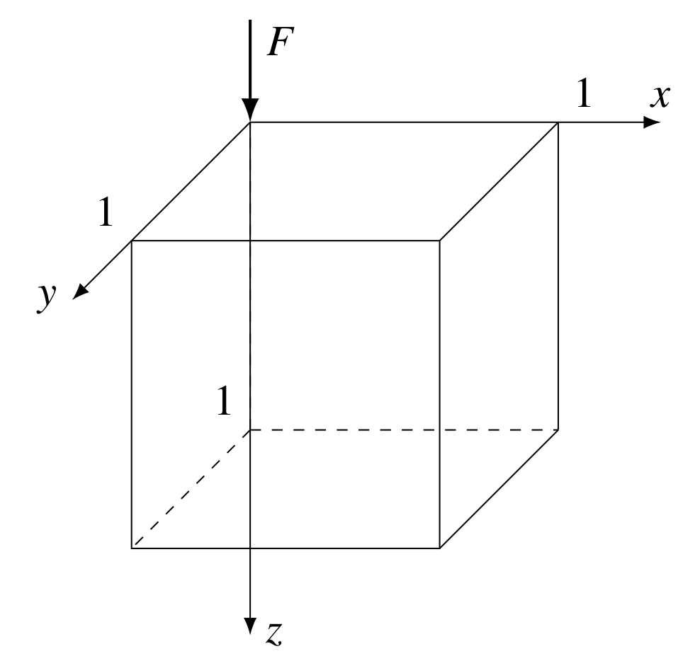
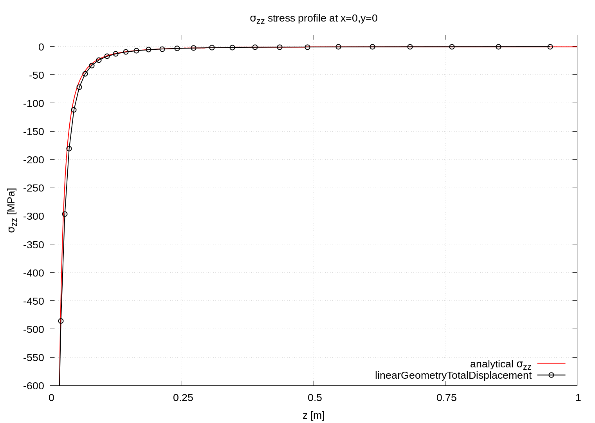
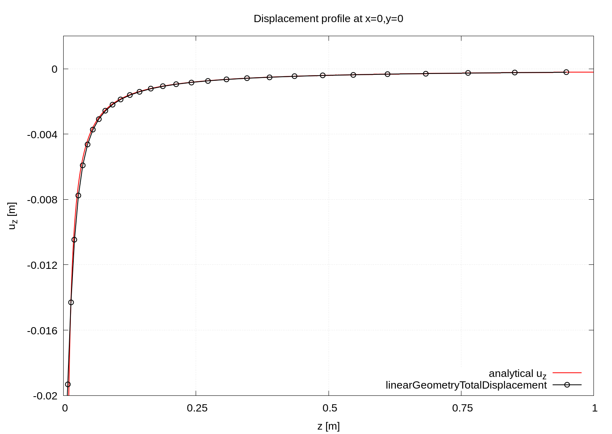

# Elastic half-space loaded with concentrated force:

# `Boussinesq problem`

---

Prepared by Ivan Batistić

---

## Case overview

This case considers the loading of the isotropic elastic half-space with a concentrated point normal load, known as the Boussinesq problem. Half-space is modelled as finite using quarter geometry with dimensions $1\times 1\times 1$ m, see Fig. 1. At planes $x=1$ and $y=1$ symmetry boundary condition is applied. The total applied force is $F=400$ kN, meaning that for quarter geometry, $100$ kN should be prescribed. To avoid error introduced by using finite dimensions of the half-space, on the boundaries of the half-space analytical solution for the displacement is prescribed. The Young's modulus is $100$ MPa, and the Poisson's ratio is $0.3$. Gravitation effects are neglected, and there are no body forces. The problem is solved as static, using one loading increment.

<div style="text-align: center;">
  
    <figcaption>
     <strong>Figure 1: Problem geometry</strong>
    </figcaption>
</div>

```warning
The case is set using foam-extend 4.1. 
Other versions of the OpenFOAM may require some small tweaks.
```

---

## Benchmark purpose

* To test the solver when a deformable body is loaded with a concentrated point load;
* The analytical solution can be used to check the resulting solution fields.

---

## Expected results

* Displacements decay as $\sim r^{-1}$

* Stress decay as $\sim r^{-2}$

* Boussinesq analytical solution for displacement field is [[1](https://www.cambridge.org/core/books/contact-mechanics/E3707F77C2EBCE727C3911AFBD2E4AC2), [2](https://www.sciencedirect.com/book/9780123744463/elasticity)]:

  $u_x = \dfrac{F}{4\pi G}\left( \dfrac{xz}{r^3} -(1-2\nu) \dfrac{x}{r(r+z)} \right),$

  $u_x = \dfrac{F}{4\pi G}\left( \dfrac{yz}{r^3} -(1-2\nu) \dfrac{y}{r(r+z)} \right),$

  $u_z = \dfrac{F}{4\pi G}\left( \dfrac{z^2}{r^3} +  \dfrac{2(1-\nu)}{r} \right),$

  and for the stress field:
  
  $\sigma_x = \dfrac{F}{2\pi} \left[ \dfrac{1-2\nu}{\rho^2} \left( \left( 1-\dfrac{z}{r}  \right)\dfrac{x^2-y^2}{\rho^2} + \dfrac{zy^2}{r^3} \right) -  \dfrac{3zx^2}{r^5}\right],$

  $\sigma_y = \dfrac{F}{2\pi} \left[\dfrac{1-2\nu}{\rho^2}\left( \left\(1-\dfrac{z}{r}  \right) \dfrac{y^2-x^2}{\rho^2} + \dfrac{zx^2}{r^3} \right) -  \dfrac{3zy^2}{r^5}\right],$

  $\sigma_{zz} = -\dfrac{3F}{2\pi} \dfrac{z^3}{r^5},$

  $\sigma_{xy} = \dfrac{F}{2\pi} \left[\dfrac{1-2\nu}{\rho^2}\left( \left(1-\dfrac{z}{r}  \right) \dfrac{xy}{\rho^2} - \dfrac{xyz}{r^3} \right) -  \dfrac{3xyz}{r^5}\right],$

  $\sigma_{xz} = -\dfrac{3F}{2\pi} \dfrac{xz^2}{r^5},$

  $\sigma_{yz} = -\dfrac{3F}{2\pi} \dfrac{yz^2}{r^5},$

  where $r$ and $\rho$ are:
  
  $r = \sqrt{x^2+y^2+z^2}, \qquad \rho = \sqrt{x^2+y^2}.$


The analytical solution is generated alongside solution fields using the function object `BoussinesqProblemAnalyticalSolution` which is compiled when running `>./Allrun` script. Function object inputs are located in `controlDict` where one needs to enter force vector, Young's modulus and Poisson's ratio:

```
functions
{
    analyticalSolution
    {
        type    BoussinesqProblemAnalyticalSolution;

        // Applied force
        force   (0 0 -4e5);

        // Young's modulus
        E       1e9;

        // Poisson's ratio
        nu      0.3;
    }
}
```

The boundary condition `analyticalBoussinesqProblemDisplacement` for the half-space sides is located in `0/D` and requires the same entries: 

```
type            analyticalBoussinesqProblemDisplacement;
force           (0 0 -4e5);
E               1e9;
nu              0.3;
value           uniform (0 0 0);
```

Figure 1 shows the distribution of $\sigma_{zz}$ stress along the $z-$axis, whereas Figure 2 shows the distribution of vertical displacement $u_z$. Diagrams are generated using `plot.gnuplot` script located in the case directory. At force location, analytical fields tend to infinity, whereas numerically obtained ones are finite. In other words, the analytical solution assumes that force acts at a point whereas in simulation it is distributed along a finite area, i.e. along the boundary face. 

<div style="text-align: center;">
  
    <figcaption>
     <strong>
       <br>  Figure 2:  Stress profile along the z-axis (fe41-linearGeometryTotalDisplacement solver)
     </strong>
    </figcaption> 
</div>

<div style="text-align: center;">
  
    <figcaption>
     <strong>
       <br>  Figure 3: Displacement profile along the z-axis (fe41-linearGeometryTotalDisplacement solver)
     </strong>
    </figcaption>
</div>

---

### References 

[1] [K. L. Johnson, Contact Mechanics. Cambridge University Press, 1985.](https://www.cambridge.org/core/books/contact-mechanics/E3707F77C2EBCE727C3911AFBD2E4AC2)

[2] [Sadd MH. Elasticity: Theory, Applications, and Numerics. Elsevier 2009.](https://www.sciencedirect.com/book/9780123744463/elasticity)
