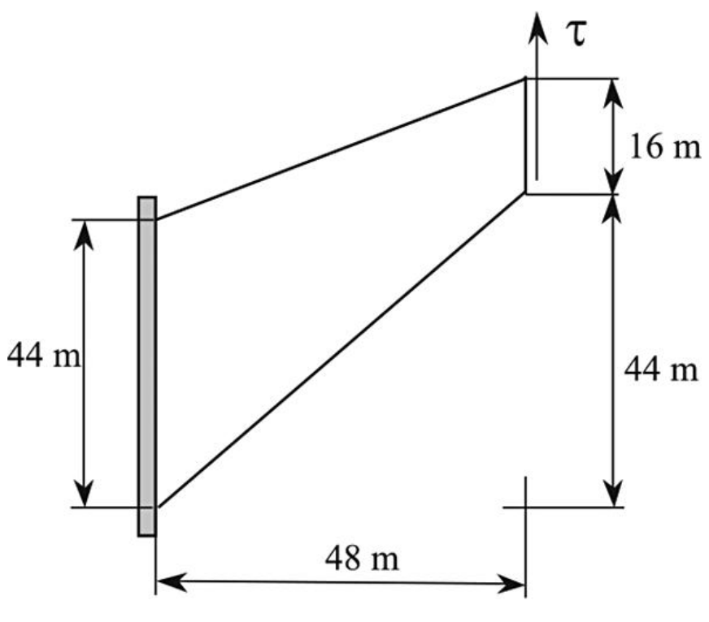

# Cook's membrane

---

## Case overview
Cook's membrane is well-known bending-dominated benchmark case.
The tapered panel (trapezoid) is fixed on one side and subjected to uniform shear traction on the opposite side.
The prescribed shear traction is 6250 N/m^2.
The vertices of the trapezoid (in mm) are (0, 0), (48, 44), (48, 60), and (0, 44). Membrane geometry is shown in the figure below.
Young's modulus is set to 70 Pa and Poisson's ratio to 1/3.
Gravitation effects are neglected, and there are no body forces.
The problem is solved as static, using one loading increment.

The script is adjusted to perform simulation on 7 uniformly refined grids.
The coarsest grid consists of 36 CVs and the finest of 147456 CVs.

There is no known analytical solution for this problem.

The purpose of this benchmark problem is:
* To test solver under different Poisson's ratios (incompressibility)
* To test the solver under pure bending conditions, which are known to be very challenging for the segregated solution procedure.

---

## Expected results

* Around the top-left corner, the elastic body is squeezed the most
* The body is stretched the most near the bottom side

###  Comparison with FEM (results from [1])

|   Solver   |   Very Fine Mesh    quadratic (Hexahedral mesh) | Very Fine Mesh    quadratic (Tetrahedral mesh)   |
|:----------:|:--------------------------------------------------:|:---------------------------------------------------:|
|  Calculix  |                  32.27                             |                          32.27                      |
| Code_Aster |                  32.20                             |                          32.20                      |
|    Elmer   |                  32.28                             |                          32.27                      |
|            |                                                    |                                                     |
|  OpenFOAM  |                  32.36

---

## Literature 

[1] https://cofea.readthedocs.io/en/latest/benchmarks/002-cook-membrane/results.html

[2] O.C. Zienkiewicz, R.L. Taylor. The finite element method. Butterworth Heinemann, 2000.

[2] Kasper EP, Taylor RL. A mixed-enhanced strain method: 
Part I: Geometrically linear problems. Computers & Structures. 2000 Apr 1;75(3):237-50.

__FVM literature where this example is used__

[3] Bijelonja I, Demirdžić I, Muzaferija S. Mixed finite volume method for linear 
thermoelasticity at all Poisson’s ratios. Numerical Heat Transfer, 
Part A: Applications. 2017 Aug 3;72(3):215-35.

