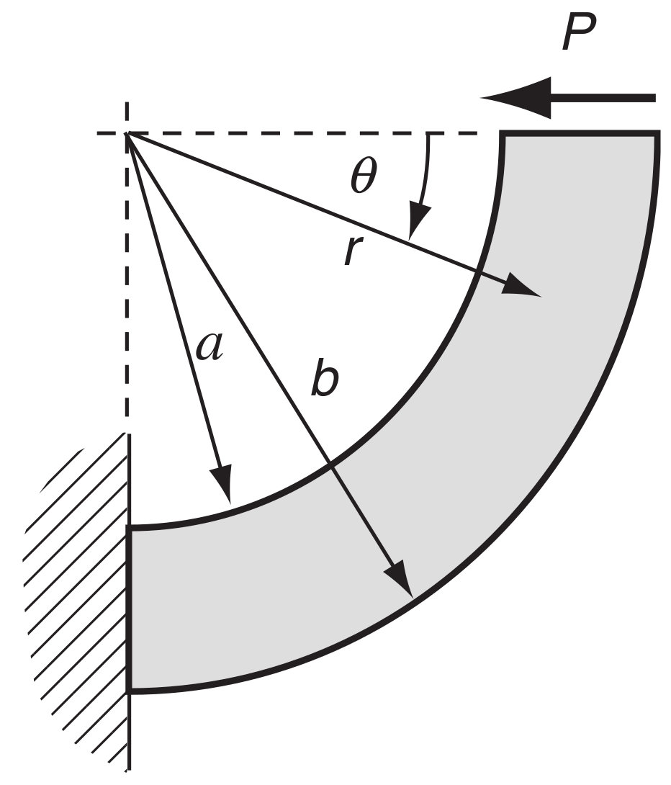
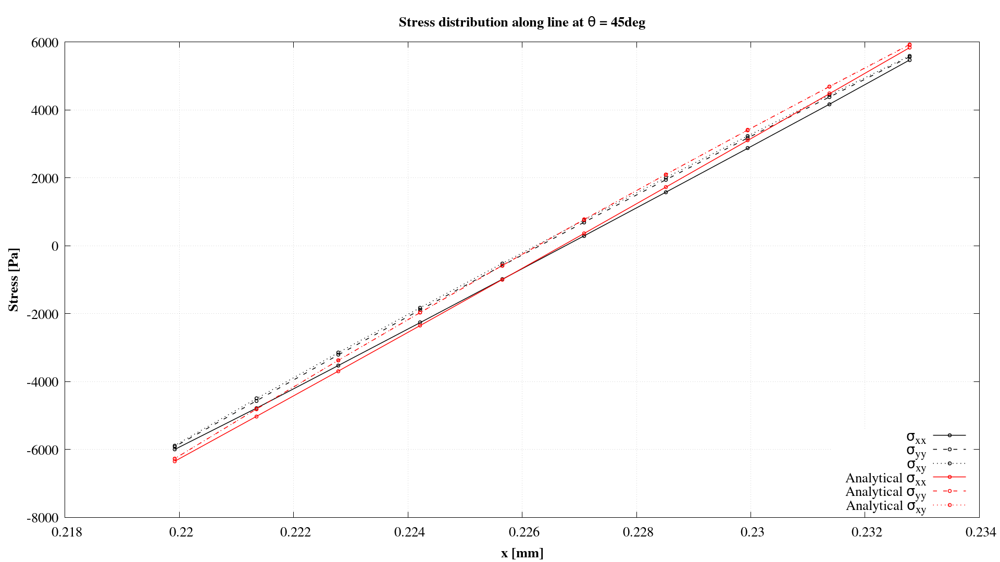
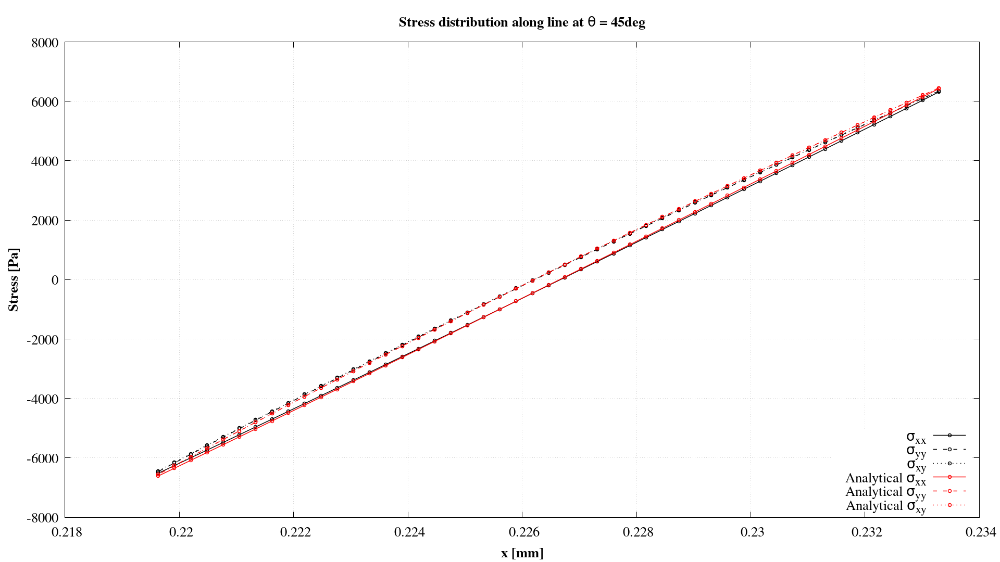

# `Curved cantilever beam`

---

Prepared by Ivan Batistić

---

## Case overview

The curved cantilever beam is fixed on the left side and the right side has prescribed horizontal traction, as shown in Fig 1. The prescribed horizontal traction is 200 Pa. The beam inner radius is set to $a=$ 0.31 m and the beam outer radius to $b = $ 0.33 m. The Young's modulus is $E=$ 100 Pa, and the Poisson's ratio is $\nu=$ 0.3. Gravitation effects are neglected, and there are no body forces. The problem is solved as static, using one loading increment.

<div style="text-align: center;">
  
    <figcaption>
     <strong>Figure 1: Problem geometry [1]</strong>
    </figcaption>
</div>

```warning
The case is set using foam-extend 4.1. 
Other versions of the OpenFOAM may require some small tweaks.
```

---

## Benchmark purpose

* To test if the shear locking effect is presented
* To demonstrate solver performance under bending conditions 

---

## Expected results

* Stress is dependent on the angular coordinate $\theta$

* The analytical solution for the stress field is [[1]](https://www.sciencedirect.com/book/9780123744463/elasticity):
  $$
  \sigma_{r} = \frac{P}{N}\left(r+\frac{a^2b^2}{r^3}-\frac{a^2+b^2}{r}\right)\sin (\theta)\\
  \sigma_{\theta} = \frac{P}{N}\left(3r-\frac{a^2b^2}{r^3}-\frac{a^2+b^2}{r}\right)\sin (\theta)\\
  \tau_{r\theta} = \tau_{\theta r} =-\frac{P}{N}\left(r+\frac{a^2b^2}{r^3}-\frac{a^2+b^2}{r}\right)\cos (\theta)
  $$
  The analytical solution is generated alongside solution fields using the function object compiled when running `>./Allrun` script. Function object inputs are located in `controlDict `where one needs to input geometry and material data:

  ```
  functions
  {
      analyticalSolution
      {
          type    curvedCantileverAnalyticalSolution;
  
          // Inner beam radius
          rInner  0.31;
  
          // Outer beam radius
          rOuter  0.33;
  
          // Applied shear force (in N/m)
          force   4;
  
          // Young's modulus
          E       100;
  
          // Poisson's ratio
          nu      0.3;
      }
  }
  ```


Figures 2 and 3 are showing $\sigma_{xx}$, $\sigma_{xy}$ and $\sigma_{yy}$ stress distributions along the line $\theta$=45$^{\circ}$ for computational meshes consisting of 100×100 and 200×50 control volumes. One can see that with mesh refinement, numerical results are converging to analytical ones. Plots are generated using `foam-extend 4.1` and with block-coupled solver named`coupledUnsLinearGeometryLinearElastic`.

<div style="text-align: center;">
  
    <figcaption>
     <strong>Figure 2: Stress distribution for mesh consisting of 100x10 CVs</strong>
    </figcaption>
</div>

<div style="text-align: center;">
  
    <figcaption>
     <strong>Figure 3: Stress distribution for mesh consisting of 200x50 CVs</strong>
    </figcaption>
</div>


---

### References 

[1] [Sadd MH. Elasticity: Theory, Applications, and Numerics. Elsevier 2009.](https://www.sciencedirect.com/book/9780123744463/elasticity)

[2] [Pablo Castrillo, Alfredo Canelas, Eugenio Schillaci, Joaquim Rigola and Asensio Oliva. High-order finite volume method for linear elasticity on unstructured meshes. Computers & Structures. Volume 268, 2022,](https://www.sciencedirect.com/science/article/pii/S004579492200089X)

