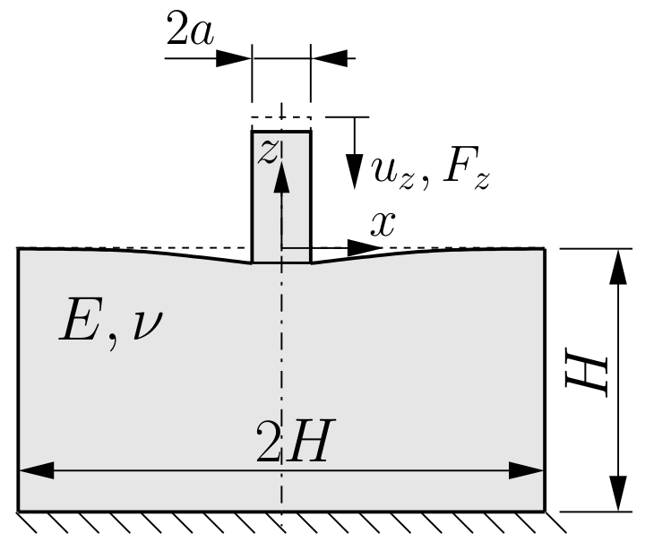
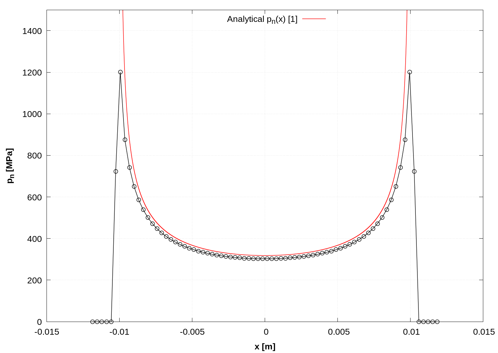

# `Indentation of elastic half-space with a flat-ended rigid indenter`

---

Prepared by Ivan Batistić

---

## Case overview

This case consists of a rigid flat-ended indenter pressed onto an elastic-half space (Figure 1). The elastic half-space is modelled as finite, with dimensions $$2H \times H$$, a Young’s modulus $$E = 200$$ GPa and a Poisson’s ratio $$\nu= 0.3$$. The problem is solved by assuming a plane stress state and a 2-D model with unit thickness. The top surface of the rigid indenter has a prescribed vertical displacement $$u_z = 0.0967$$ mm corresponding to vertical force $$F_z = 10 000$$ N (see Eq (4)). The bottom surface of the finite half-space is held fixed (zero displacement). The contact between the punch and the elastic half-space is modelled as frictionless.

  
    <figcaption>
     <strong>Figure 1: Problem geometry (H = 0.2 m, a = 0.01 m) [1]</strong>
    </figcaption>

---

## Benchmark purpose

* With the available analytical solution, it is possible to check the resulting fields
* To demonstrate solver performance when solving contact problems between rigid and deformable body

---

## Expected results

* The analytical solution for the pressure distribution (plane stress) is [[2]](https://www.cambridge.org/core/books/contact-mechanics/E3707F77C2EBCE727C3911AFBD2E4AC2):

  $$
  p_n(x) = \frac{F}{\pi\sqrt{a^2-x^2}} \qquad \text{for } |x| \leq a,
  $$

  where $$a$$ is half the contact width and $$x$$ is the horizontal coordinate. This pressure distribution is singular at the edge ($$x \equiv \pm a$$) of the fixed contact zone.

  The displacement of the rigid indentor $$d$$, related to the applied force $$F$$, can be obtained using:

  $$
  u_z = \frac{F}{\pi E}\left[ 2 \text{ln} \left(\frac{2L}{a}\right) - (1+\nu) \right],
  $$

  where $$L$$ is the thickness of the elastic half-space.

  The boundary displacement outside the contact zone can be calculated as:

  $$
  u_z(x) = u_z + \frac{2(1-\nu^2)F}{\pi E} \text{ ln} \left[ \frac{x}{a} + \sqrt{\frac{x^2}{a^2}-1} \right] \qquad \text{for } |x| \geq a.
  $$

  Figure 2 shows the distribution of the contact pressure. The diagram is created automatically within the `Allrun` script using `sample` utility and `gnuplot`. Further mesh refinement would lead to a closer approximation of the analytical solution. As the mesh is refined, the predicted contact pressure at the contact edge goes to infinity, as expected.

  The main cause of the shift between the analytical and the numerical curve is the applied pressure calculation method in the `solidContact` boundary condition. The arising error can be reduced with mesh refinement or by using the pressure integration method proposed in [[1]](https://repozitorij.unizg.hr/islandora/search/Segment-to-Segment%20Algorithm%20for%20Finite%20Volume%20Mechanical%20Contact%20Simulations?type=dismax) (this improved contact condition will soon be available in solids4foam).

  

    
      <figcaption>
       <strong>Figure 2: Contact pressure distribution</strong>
      </figcaption>
  

  Figure 3 shows the displacement profile of the half-space top surface. The displacement profile from `solids4Foam` matches the analytical one; a small discrepancy between results exists because the analytical solution has an abrupt profile change at the contact edge. As in Figure 2, the diagram shown in Figure 3 is automatically created within the `Allrun` script using `sample` utility and `gnuplot`. 

  

    
      <figcaption>
       <strong>Figure 3: Vertical displacement of the top half-space surface</strong>
      </figcaption>
  

---

### References 

[1] [Ivan Batistić. Segment-to-Segment Algorithm for Finite Volume Mechanical Contact Simulations. University of Zagreb, PhD thesis, 2022.](https://repozitorij.unizg.hr/islandora/search/Segment-to-Segment%20Algorithm%20for%20Finite%20Volume%20Mechanical%20Contact%20Simulations?type=dismax)

[2] [K. L. Johnson, Contact Mechanics. Cambridge University Press, 1985.](https://www.cambridge.org/core/books/contact-mechanics/E3707F77C2EBCE727C3911AFBD2E4AC2)

