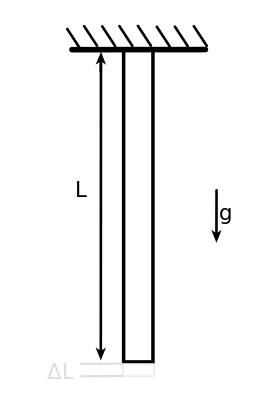
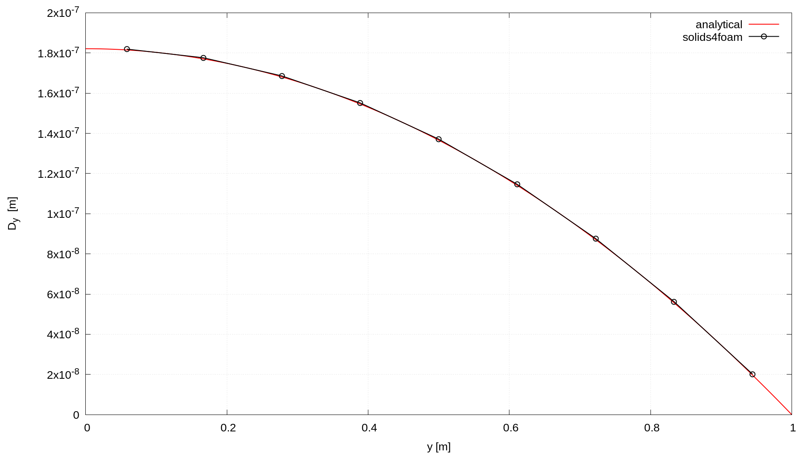
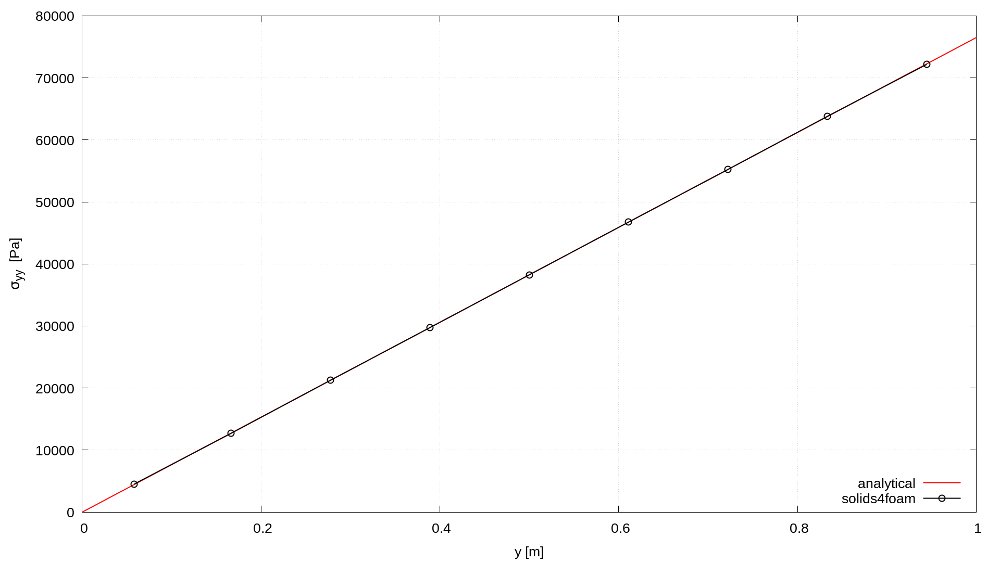

# Bar Subjected to Self-Weight: `hangingBar`

---

Prepared by Ivan Batistić

---

## Case overview

A steel bar with a uniform square cross-section ($$0.1 \times 0.1$$ m) and length of $$L=1$$ m is connected vertically at its top end with fixed support; see Figure 1. The bottom end is traction-free, and the bar is loaded only with gravity ($$g = 9.80665$$ m$$^2$$/s). The Young modulus of bar material is $$210$$ GPa, the Poisson's ratio is $$0.28$$ and the density is $$7800$$ kg/m$$^3$$. The bar is discretised axially using 9 CVs and the case is solved as 2D using plane stress assumption and using one loading step.

<div style="text-align: center;">
  
    <figcaption>
     <strong>Figure 1: Problem geometry</strong>
    </figcaption>
</div>


```warning
The case is set using foam-extend 4.1. 
Other versions of the OpenFOAM may require some small tweaks.
```

---

## Benchmark purpose

* To check the solution when only body force governs deformation;

---

## Expected results

* Total elongation of the bar under the action of the self-weight:
  $$
  \Delta L = \dfrac{g \rho L^2}{2E}.
  $$
  

* The stress in the cross-section of the bar located at a distance $$x$$ from lower (unconstrained) edge:
  $$
  \sigma = g \rho x.
  $$
  


**Table 1: Comparison of maximal displacement and stress values with the analytical solution **

|                    Numerical solution                    |         Analytical         | Relative error (in $$\%$$) |
| :------------------------------------------------------: | :------------------------: | :------------------------: |
| Displacement (at $$x=1$$ m): $$-1.82124\cdot 10^{-7}$$ m | $$-1.8212\cdot 10^{-7}$$ m |        $$0.002\%$$         |
|          Stress (at $$x=0$$ m):  $$76491.9$$ Pa          |        $$76492$$ Pa        |        $$0.0001\%$$        |

Figures 2 and 3 show the distribution of stress and displacement across bar length. One can see that numerical results match perfectly with the analytical ones. Results are extracted using the `sample` utility and plotted using the `plot.gnuplot` script.  Plots on figures 2 and 3  are generated using `foam-extend 4.1` and with `linearGeometry` solver.

<div style="text-align: center;">
  
    <figcaption>
     <strong>Figure 2: Displacement distribution</strong>
    </figcaption>
</div>

<div style="text-align: center;">
  
    <figcaption>
     <strong>Figure 3: Stress distribution</strong>
    </figcaption>
</div>


---

### References 

[1] [https://autofem.com/en/examples.html](https://autofem.com/examples/bar_subjected_to_self-weight.html)

