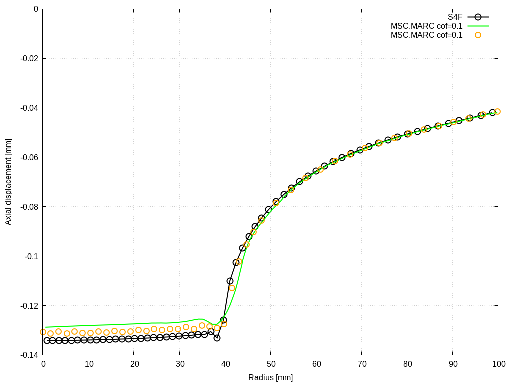
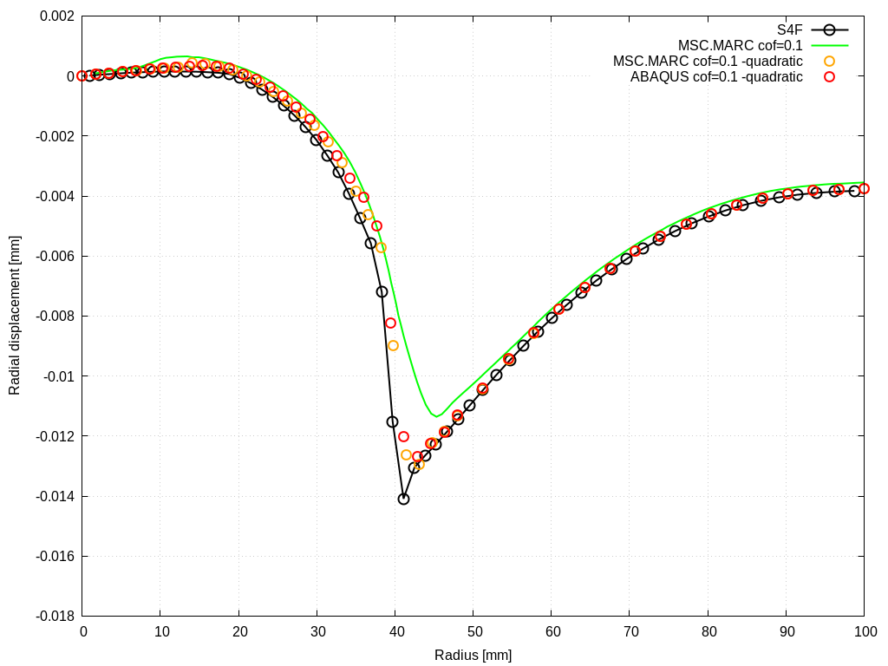
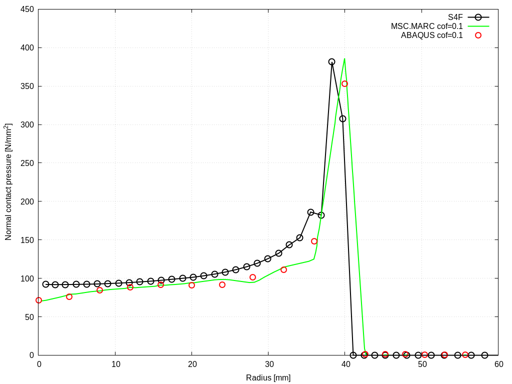
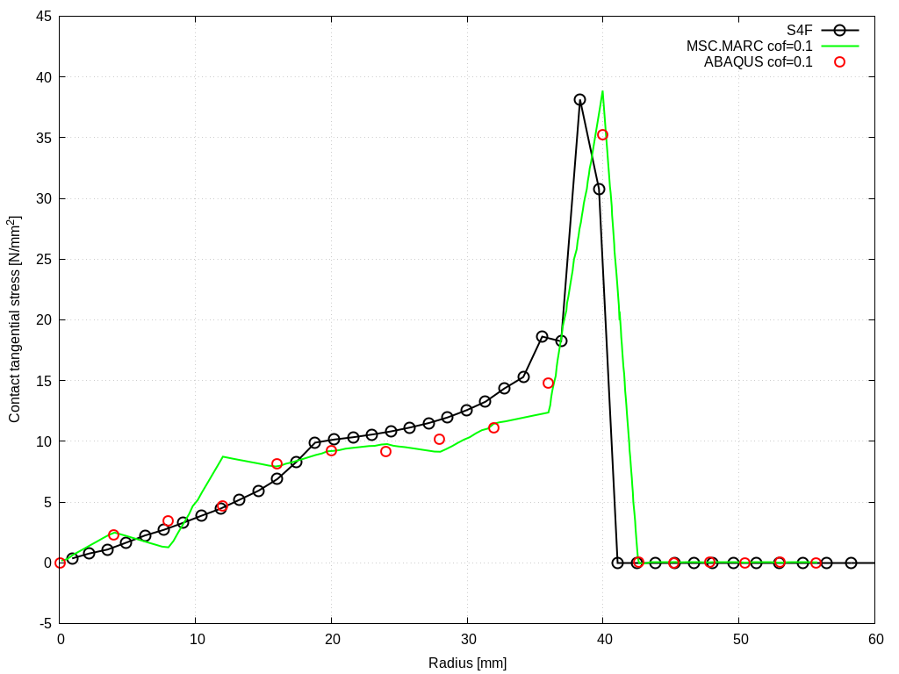

# Cylindrical punch with rounded edge: `punchAxisymmetric`

---

Prepared by Ivan Batistić

---

## Case Overview

In this example, a cylindrical punch is pressed into an elastic cylindrical foundation (Figure 1). This case is proposed as a contact mechanics benchmark by the National Agency for Finite Element Methods and Standards (NAFEMS) [[1]](https://www.nafems.org/publications/resource_center/r0094/). The material properties of the punch are similar to steel ($$E_p = 210$$ GPa, $$\nu_p = 0.3$$), whereas the foundation has aluminium properties ($$E_f = 70$$ GPa, $$\nu_f = 0.3$$).  The punch is loaded with a uniform pressure distribution at its top surface $$p = 100$$ MPa. The bottom surface of the elastic foundation is fixed. Friction is considered, and the coefficient of friction is set to $$\mu=0.1$$. The problem is solved with one load increment, neglecting inertia and gravity effects. The case is solved using axisymmetric computational model. The results for the 3D version can be found in  [[2]](https://arxiv.org/abs/1808.10736).

<div style="text-align: center;">
  
    <figcaption>
     <strong>Figure 1: Problem geometry and computational mesh [3]</strong>
    </figcaption>
</div>


---

## Benchmark purpose

* To test solver when considering frictional contact under small deformations regime.

---

## Expected Results

The resulting displacement and stress fields are expected to be axisymmetric. At the edge of the contact region, a stress peak can be expected due to the singular pressure distribution. More precisely, the cylinder fillet radius is too small to avoid having a geometric discontinuity causing a singular pressure distribution. This means peak contact pressures increase at this location with increasing mesh density; however, note that displacement fields converge to a mesh-independent solution.

Fig. 2 shows the radial and axial displacement profile for the cylindrical foundation. Figure 3 shows the profiles of normal and tangential contact stresses. Both figures are obtained using the `fe-41` and `linearGeometry` solver. Note that results from [[1]](https://www.nafems.org/publications/resource_center/r0094/) are added for comparison purposes.  These figures are automatically created when running the case using the `Allrun` script.  

<div style="text-align: center;">
  
  
    <figcaption>
     <strong>Figure 2: Radial and axial displacement profiles</strong>
    </figcaption>
</div>

<div style="text-align: center;">
  
  
    <figcaption>
     <strong>Figure 3: Normal and tangential contact stress profiles </strong>
    </figcaption>
</div>
```warning
The case is set using foam-extend 4.1. 
Other versions of the OpenFOAM may require some small tweaks.
```


---

### References 

[1] [A. Konter, FENet (Project), and National Agency for Finite Element Methods & Standards (Great Britain), Advanced Finite Element Contact Benchmarks. NAFEMS Limited, 2006.](https://www.nafems.org/publications/resource_center/r0094/)

[2] [P. Cardiff, A. Karač, P. De Jaeger, H. Jasak, J. Nagy, A. Ivanković, and Ž. Tuković, “An open-source finite volume toolbox for solid mechanics and fluid-solid interaction simulations,” arXiv preprint arXiv:1808.10736, 2018.](https://arxiv.org/abs/1808.10736)

[3] [Ivan Batistić. Segment-to-Segment Algorithm for Finite Volume Mechanical Contact Simulations. University of Zagreb, PhD thesis, 2022.](https://repozitorij.unizg.hr/islandora/object/fsb%3A8301)
