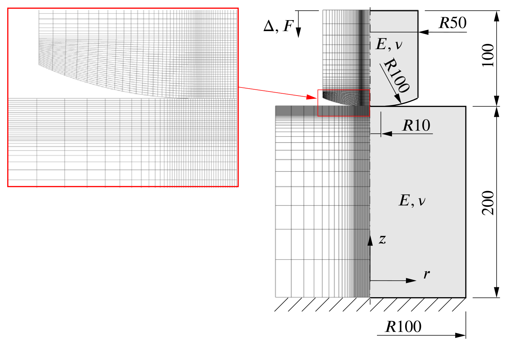
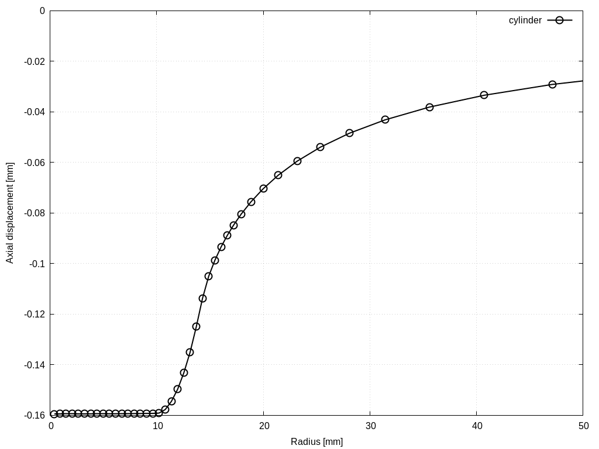
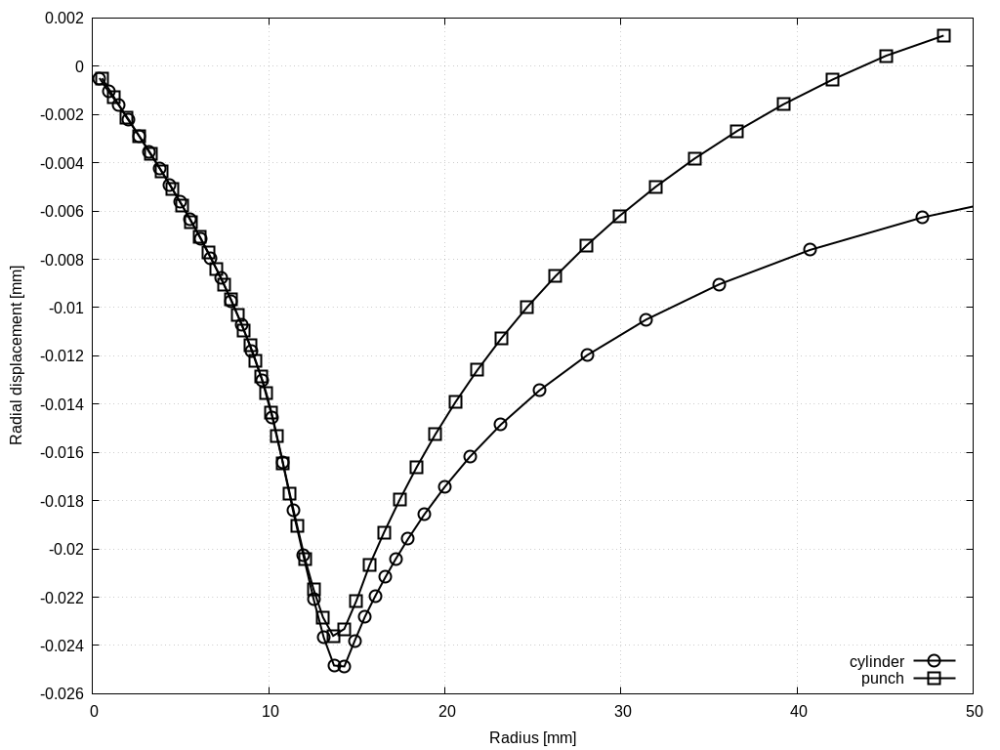
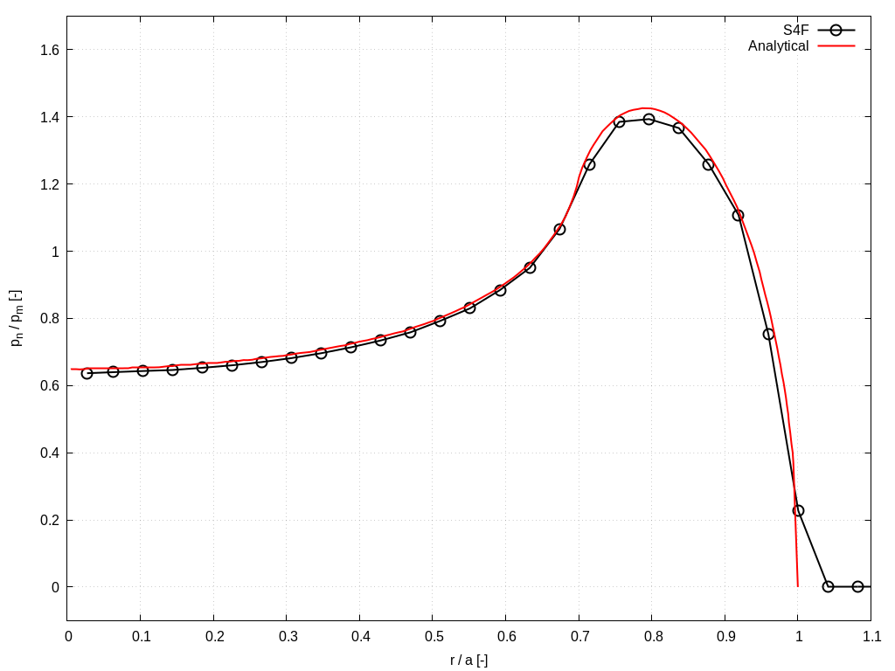
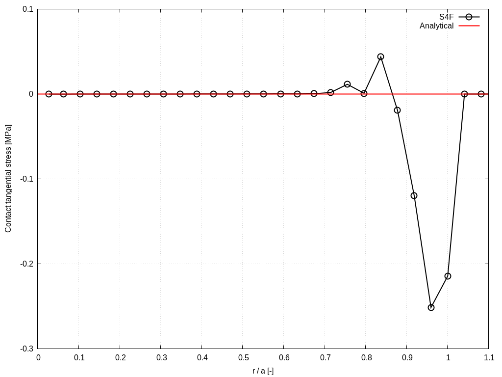

# Cylindrical punch with rounded edge: `punchAxisymmetricModified`

---

Prepared by Ivan Batistić

---

## Case Overview

This example is based on the case proposed by NAFEMS [[1]](https://www.nafems.org/publications/resource_center/r0094/) (see `punchAxisymmetric` case), with modifications made to incorporate an analytical solution for validating the resultant pressure distribution. Problem geometry is similar to the one  in `punchAxisymmetric` case; however, a much larger fillet radius is taken to reduce peak contact pressure at the transition edge between the punch flat and filleted part. Furthermore, both bodies have the same material properties ($$E = 100$$ GPa, $$\nu = 0.3$$) to allow the use of the semi-analytical solution [2,3]. From the analytical solution, the required punch top surface displacement and force can be calculated for the targeted ratio $$b/a = 0.7$$ where $$a$$ is the contact half-width and $$b$$ is the radius of the punch flat zone ($$10$$ mm). For the force-loading case, calculated force from analytical solution is $$F =  4657$$ N, whereas for the displacement-loading case, the displacement is $$\Delta = 0.32115$$ mm. Here, the case is solved as displacement-loading, using one displacement increment and neglecting gravity. The employed axisymmetric computational mesh and problem geometry are shown in Figure 1. 

<div style="text-align: center;">
  
    <figcaption>
     <strong>Figure 1: Problem geometry and computational mesh [4,5]</strong>
    </figcaption>
</div>


---

## Benchmark purpose

* To validate solver results when considering a frictional contact problem in small deformation settings.

---

## Expected Results

Figure 2 illustrates radial and axial displacement profiles. In the contact zone, the radial displacement distribution aligns closely between the punch and cylinder, indicating negligible relative tangential displacement between these surfaces. Consequently, the tangential traction is expected to be zero, as confirmed by examining the tangential traction plot in Fig. 3.

Figure 2 presents the normalised contact pressure distribution. Unlike the `punchAxisymmetric` case, where a stress peak occurs at the contact zone's edge, the modified geometry in this case ensures a finite pressure distribution. In other words, the peak contact pressure value can converge with mesh refinement.

Figures are obtained using the `fe-41` and `linearGeometry` solver. These figures are automatically created when running the case using the `Allrun` script.  

<div style="text-align: center;">
  
  
    <figcaption>
     <strong>Figure 2: Radial and axial displacement profiles</strong>
    </figcaption>
</div>

<div style="text-align: center;">
  
  
    <figcaption>
     <strong>Figure 3: Normal and tangential contact stress profiles </strong>
    </figcaption>
</div>

```warning
The case is set using foam-extend 4.1. 
Other versions of the OpenFOAM may require some small tweaks.
```


---

### References 

[1] [A. Konter, FENet (Project), and National Agency for Finite Element Methods & Standards (Great Britain), Advanced Finite Element Contact Benchmarks. NAFEMS Limited, 2006.](https://www.nafems.org/publications/resource_center/r0094/)

[2] [Ciavarella M. Indentation by nominally flat or conical indenters with rounded corners. Int J Solids Struct. 1999;36(27):4149-4181.](https://eprints.soton.ac.uk/23223/)

[3] [Popov VL, Heß M, Willert E. Handbook of Contact Mechanics: Exact Solutions of Axisymmetric Contact Problems. Springer Nature; 2019.](https://link.springer.com/book/10.1007/978-3-662-58709-6)

[4] [Batistić I, Cardiff P, Ivanković A, Tuković Ž. A finite volume penalty-based implicit procedure for the treatment of the frictionless contact boundaries. Int J Numer Methods Eng. 2023](https://onlinelibrary.wiley.com/doi/full/10.1002/nme.7302)

[5] [Ivan Batistić. Segment-to-Segment Algorithm for Finite Volume Mechanical Contact Simulations. University of Zagreb, PhD thesis, 2022.](https://repozitorij.unizg.hr/islandora/object/fsb%3A8301)
